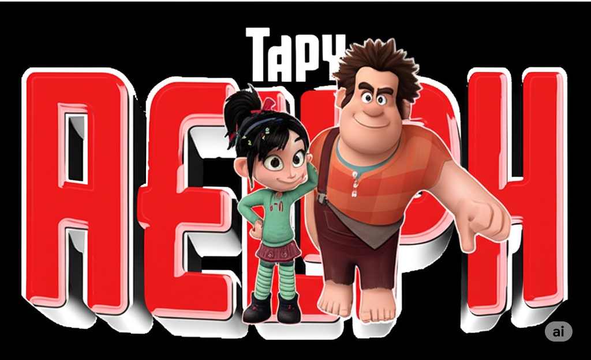

# 🕹️ Game: Encontre o Detona Ralph 🎮🧠



## 📚 Descrição

Este é um mini jogo da memória desenvolvido em HTML, CSS e JavaScript, onde o objetivo é encontrar os pares de cartas e, principalmente, encontrar o personagem **Detona Ralph**!

O jogo começa com uma tela de login, onde o jogador digita seu nome. Após iniciar, será desafiado a encontrar os pares o mais rápido possível. Um vídeo de introdução em looping é reproduzido ao fundo, dando uma atmosfera divertida e nostálgica ao jogo.

---

## 🚀 Funcionalidades

- Tela inicial com campo de login (nome do jogador).
- Botão "Iniciar Jogo" habilitado somente após digitação.
- Background animado com vídeo do **Detona Ralph**.
- Layout responsivo e com estilo retrô gamer.
- Créditos com link para o GitHub do desenvolvedor.
- Preparado para futuras versões.

---

## 🧪 Tecnologias Utilizadas

- **HTML5** – Estrutura semântica da página.
- **CSS3** – Estilização e responsividade.
- **JavaScript Vanilla** – Interatividade e lógica de validação.
- **Vídeo em MP4** – Para background animado.
- **Git/GitHub** – Versionamento e colaboração.

---

## 📷 Captura de Tela

> *(adicione aqui imagens se desejar, como prints da tela de login e do jogo em ação)*

---

## 💻 Como Usar

1. Clone este repositório:
   ```bash
   git clone https://github.com/seu-usuario/seu-repositorio.git
Navegue até a pasta do projeto:

bash
Copiar
Editar
cd seu-repositorio
Abra o arquivo index.html em seu navegador:

Basta clicar duas vezes no arquivo OU

Rodar com uma extensão como Live Server (VSCode)

🔧 Estrutura de Pastas
pgsql
Copiar
Editar
📁 src
│
├── 📁 imagens
│   └── logo.png
│
├── 📁 styles
│   ├── reset.css
│   └── login.css
│
├── 📁 scripts
│   └── login.js
│
├── 📁 videos
│   └── introRalph.mp4
│
└── index.html
🤝 Contribuições
Contribuições são bem-vindas! Se você quiser sugerir melhorias, adicionar funcionalidades ou corrigir bugs:

Faça um Fork do projeto

Crie uma branch com sua feature

Faça um commit claro e objetivo

Envie um Pull Request

👨‍💻 Desenvolvedor
Desenvolvido por Pedro de Souza Galvão Junior

📄 Licença
Este projeto está licenciado sob a MIT License – veja o arquivo LICENSE para mais detalhes.

🌐 Link do Projeto (opcional)
(Se estiver hospedado, como no GitHub Pages ou Vercel, você pode inserir o link aqui)
